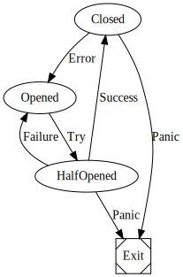

[](https://travis-ci.org/storozhukBM/go-fsm-generator)

# Finite state machine generation tool

`go-fsm-generator` generates all states, events and behavioral interfaces for your state machine.

- It will statically analyze you FSM definition and can point out some problems during generation.
- Generated code designed to prevent impossible state transitions, so it is easy and safe to use.
- Automatically detects terminal states.
- Visualize your FSM in generation time and in runtime using Graphwiz notation [`dot`].
- Created with `go generate` in mind.

# Example
As an demonstration we have implemented circuit breaker state machine in `examples` folder.

We use simple struct fields to declare FSM states 
and field tags to define state transitions.

```go
//go:generate ../go-fsm-generator -type CBMDeclaration -v

type FSMState int

type CBMDeclaration struct {
	Opened     FSMState `Try:"HalfOpened"`
	HalfOpened FSMState `Success:"Closed",Failure:"Opened",Panic:"Exit"`
	Closed     FSMState `Error:"Opened",Panic:"Exit"`
	Exit       FSMState
}
```

As an result we will get flowing FSM




Take a look at `examples` folder for details.

##### License
Copyright 2018 Bohdan Storozhuk

Licensed under the Apache License, Version 2.0 (the "License"); you may not use this file except in compliance with the License. You may obtain a copy of the License at

    http://www.apache.org/licenses/LICENSE-2.0

Unless required by applicable law or agreed to in writing, software distributed under the License is distributed on an "AS IS" BASIS, WITHOUT WARRANTIES OR CONDITIONS OF ANY KIND, either express or implied. See the License for the specific language governing permissions and limitations under the License.
